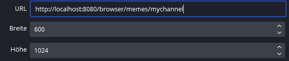

(The documentation is heavily WIP. As the bot supports english and german,
 I'm working on making the documentation support both languages too - 
 written in english but stating the german terms too.)


**Table of contents**
<!-- TOC -->
* [Pipbot - A multichannel Twitch Chatbot written in Kotlin](#pipbot---a-multichannel-twitch-chatbot-written-in-kotlin)
  * [Build from sources](#build-from-sources)
  * [Setting up the bot](#setting-up-the-bot)
  * [Obtaining oauth token](#obtaining-oauth-token)
    * [Use the OAuth token from your user account](#use-the-oauth-token-from-your-user-account)
    * [Register the bot as an app and use the clientId to let the bot generate an OAuth token](#register-the-bot-as-an-app-and-use-the-clientid-to-let-the-bot-generate-an-oauth-token)
  * [Configuring your channel](#configuring-your-channel)
  * [Features](#features)
    * [Stream recognition](#stream-recognition)
    * [Meme recognition & browser source](#meme-recognition--browser-source)
      * [Meme recording](#meme-recording)
      * [Meme browser source](#meme-browser-source)
        * [Examples](#examples)
        * [Meme browser source monitor](#meme-browser-source-monitor)
    * [Quotes](#quotes)
    * [Raid reactions](#raid-reactions)
    * [Polls](#polls)
    * [Autoresponder](#autoresponder)
    * [Automod](#automod)
      * [Automod - Phrases](#automod---phrases)
      * [Moderation - Responses](#moderation---responses)
    * [Other commands](#other-commands)
* [Developer information](#developer-information)
  * [Writing own modules](#writing-own-modules)
    * [Add listener for event to react to](#add-listener-for-event-to-react-to)
    * [Process the event](#process-the-event)
    * [Publish a response event (optional)](#publish-a-response-event-optional)
<!-- TOC -->

# Pipbot - A multichannel Twitch Chatbot written in Kotlin
Disclaimer: I'm working on making the bot multilanguage (at least for german and english) yet it can happen that
            not all texts are already available in english.

## Build from sources

1. Clone the git repository onto your own machine
2. Make sure you have a Java JDK 21 or newer installed on your machine
3. Make sure your have the Java installation set as JAVA_HOME environment variable or in your PATH
4. Run
```shell
./gradlew assemble
```
5. The build should be available in the ``build/libs`` directory

## Setting up the bot
You need the following prerequisites:
* JVM 21 oder newer (from e.g. https://adoptium.net/de/temurin/releases/)
* An oauth-Token for the account the bot will use

1. Copy the release jar to a folder of your choice
2. Set up authentication.yml 
    * Download the template `authentication_template.yml` into the same folder as the release
    * Rename the template file to `authentication.yml`
    * Edit the following values in the file
        * Set `twitch-connector.authentication.user` to the username the bot should use
        * Set `twitch-connector.authentication.oAuth` with the oauth token of your bot's account 
          (see section [Obtaining oauth token](#obtaining-oauth-token)  if you don't have one at hand)
3. The bot can be started via the command line
```shell
java -jar pipbot.jar
```
4. As soon as the bot started you can reach the gui via [\<Link to gui>](http://localhost:8080)

## Obtaining oauth token

There are two methods for obtaining tokens.

### Use the OAuth token from your user account

Steps:
1. Open https://twitchapps.com/tmi and connect the app to the account you want to use with the bot.
2. The page will generate an oauth token (`oauth:...`) that you can copy directly to your `authentication.yml`

### Register the bot as an app and use the clientId to let the bot generate an OAuth token

The bot offers a simple method of obtaining an oAuth token if you registered the bot as an application within your developer account.

1. Register yourself as a dev on https://dev.twitch.tv/console 
2. Add the bot as an app, you should get a clientId and clientSecret that you can put in `authentication.yml`
3. Configure `http://localhost:8080/authtoken` as OAuth redirect URL within your app
4. Open http://localhost:8080/authtoken/refresh, the bot will then try to generate a token 
5. Copy the token to your `authentication.yml`

## Configuring your channel
To register your channel within the bot you can open the [\<channels configuration page>](http://localhost:8080/channels).
Here you can see all configured channels of your bot. 
To register a new channel just fill out the form in the lower part of the page and klick `Erstellen/Anpassen`

| Field              | Description                                                                                                                         | Hints                                                   |
|--------------------|-------------------------------------------------------------------------------------------------------------------------------------|---------------------------------------------------------|
| Kanalname          | The name of the channel your bot should join                                                                                        |                                                         |
| Sprache            | The language your bot should use within the channel (currently only "de" or "en"                                                    |                                                         |
| Shoutout           | How the bot responds to a raid                                                                                                      |                                                         |
|                    | Aus = The bot doesn't respond to raids at all                                                                                       |                                                         |
|                    | Textantwort = The bot sends a text greeting to the chat                                                                             |                                                         |
|                    | StreamElements shoutout = The bot uses the StreamElements !so command (only if StreamElements is also configured for that channel ) |                                                         |
|                    | Twitch shoutout = The bot uses twitch's /shoutout command to respond to a raid                                                      | The bot needs to be a moderator of the channel to do so |
| Shoutout whitelist | Restricts the bot's response on raiding channels to channels you trust                                                              |                                                         |
|                    | You can give a list of comma separated channel names here. The bot will then only respond to raids from these channels.             |                                                         |
|                    | You can leave the field empty if the bot should respond to all raids.                                                               |                                                         |

After creating the configuration for a channel the bot automatically joins the given channel.

Already configured channels are visible in the table in the upper part of the page. You can deactivate channels by using the deactivate/activate links. You can edit channel configurations by clicking the edit link and submitting the form afterward. You can also delete a channel completely. This will also delete related data from the bot, so use it with caution.

## Features
(This list may currently not be complete)

To use any of the feature in a twitch channel the bot needs a configuration for the given channel.
Simply add the channel via the [\<channel configuration page\>](http://localhost:8080/channels).

### Stream recognition
(documentation is WIP)

| Command                           | Description                                                                                                 |
|-----------------------------------|-------------------------------------------------------------------------------------------------------------|
| !merge                            | Merges the current stream and the last one. This is helpful if a stream was interrupted.                    |

### Meme recognition & browser source
There are two processes handling Memes:
1. Recording Memes and storing them to the bots database automatically
2. Providing a browser source to allow showing meme images directly within a stream

#### Meme recording
Recording a meme is as simple as writing a message into the chat of a connected channel.
There are different ways to record a meme.

* Links to imgflip, YouTube and twitch clips are automatically recognized and stored as meme into the database.
* Chat messages starting with `!meme ` will also be recognized and stored into the meme database. This allows texts or other links to be stored into the database.

Whenever a meme is recorded for a  channel the information about the meme is stored to the database.
This includes the channel name, the time the meme was sent, the user that sent it, the stream it was sent in as well as a link (if applicable). You can see the complete list of recorded memes in the [meme view](http://localhost:8080/memes).

| Command                           | Description                                                                                                 |
|-----------------------------------|-------------------------------------------------------------------------------------------------------------|
| !meme \<text>                     | Saves the given text as meme                                                                                |


#### Meme browser source
The bot currently supports providing imgflip memes (jpg & gif) directly as a browser source. This allows showing memes in your stream by simply setting up another browser source (similarly as the stream overlay you may already use).

To set up the browser source, add it to your OBS scene with the following settings

| Configuration | Value                                                                                |
|---------------|--------------------------------------------------------------------------------------|
| URL           | `http://localhost:8080/browser/memes/<your channel name>`                            |
| Width         | 600 (the bot currently supports only this with and will scale images accordingly)    |
| Height        | The height of your stream (to use the whole screen in case the images are very high) |

There are optional URL parameters you can provide to change the behaviour of the meme browser source.

``imgWidth`` - Changes the default width of the shown image in the browser source

``address`` - Changes the default server to use for requesting new memes in the browser source

##### Examples

| Example urls                                                                                | Used settings                                                  |
|---------------------------------------------------------------------------------------------|----------------------------------------------------------------|
| `http://localhost:8080/browser/memes/mychannel`                                             | imgWidth=600px (default)<br/> address=localhost:8080 (default) |
| `http://localhost:8080/browser/memes/mychannel?imgWidth=300px`                              | imgWidth=300px<br/> address=localhost:8080  (default)          |
| `http://localhost:8080/browser/memes/mychannel?address=123.123.123.123:1234`                | imgWidth=600px (default)<br/> address=123.123.123.123:1234     |
| `http://localhost:8080/browser/memes/mychannel?imgWidth=100px&address=123.123.123.123:1234` | imgWidth=100px<br/> address=123.123.123.123:1234               |

Example configuration in OBS using the default width (Breite) and address



Please make sure that your source is not squished in OBS by shift dragging the anchor points, else your memes will look squished too.

##### Meme browser source monitor

As the meme browser source is only showing the memes for about 10 seconds, it may be helpful to have a URL to monitor the memes for yourself that always shows the latest shown meme on your channel.

To access this monitor your can use `http://localhost:8080/browser/memes/<your channel name>/monitor`.
This view will update every second and will always show the latest meme.

The browser source monitor supports the same URL parameters as the meme browser source itself. 

``imgWidth`` - Changes the default width of the shown image in the browser source

``address`` - Changes the default server to use for requesting the last shown meme in the browser source


### Quotes
(documentation is WIP)

| Command                           | Description                                                                                                 |
|-----------------------------------|-------------------------------------------------------------------------------------------------------------|
| !zitat add \<text>                | Saves a new quote                                                                                           |
| !zitat delete \<number>           | Deleted the quote with the given number                                                                     |
| !zitat \<number>                  | Searches the quote with the given number                                                                    |
| !zitat \<text>                    | Searches a quote with the given text (if there is more than one a random one with the text will be picked)  |

### Raid reactions

On the channel configuration page you can also configure how the bot should react to raids.
The fields `Shoutout` and `Shoutout whitelist` are used to configure the bot behaviour on raids.

The field `Shoutout` controls if and how the bot reacts to raiding streamers.

| Option (german)         | Option (english)        | Description                                                                                                                                            |
|-------------------------|-------------------------|--------------------------------------------------------------------------------------------------------------------------------------------------------|
| Aus                     | Off                     | The bot will not respond to raids automatically                                                                                                        |
| Textantwort             | Respond with text       | The bot will react with a text message stating the raider's name the amount of people attending the raid and the last game the raider played on stream |
| StreamElements shoutout | StreamElements shoutout | (Only usable if you also use StreamElements) The bot will use StreamElements' `!so` command to perform a shoutout for the raider                       |
| Twitch shoutout         | Twitch shoutout         | (Only usable if your bot has moderation rights) The bot will use Twitch's `/shoutout` command to perform a shoutout for the raider                     |

The field `Shoutout whitelist` can be used to restrict to which raiding channels the bot will react.
If the field is empty, the bot will react to all raids.
If you want the bot to only react to specific raiding streams you can enter a comma separated list of channel names. The bot will then only react to raids of these channels and ignores all other raids.

### Polls

The bot can run polls of variable complexity.
Different options can be combined to configure the poll to your liking.
After the poll is closed the bot will automatically count the votes and share the result in the chat.

Please have a look at the table below to see what options are supported by the bot.

| Command                           | Description                                                                                                 |
|-----------------------------------|-------------------------------------------------------------------------------------------------------------|
| `!poll "text"`                    | Creates a quick poll with the given text (Duration: 3 Minutes, Possible answers: 1,2)                       |
| `!poll options=Yes,No,Maybe text` | Creates a poll with the given possible answer options (Duration: 3 Minutes, Possible answers: Yes,No,Maybe) |
| `!poll time=5m text`              | Creates a poll with the given duration (Duration: 5 Minutes, Possible answers: 1,2)                         |
| `!poll open=true text`            | Creates an open poll (Duration: 3 Minuten, Takes all answers given by users  )                              |
| `?<answer>`                       | Vote for an answer (Used to participate in a vote)                                                          |


### Autoresponder

The bot can be used to create automatic answers. These can be used to share specific information of your stream (e.g. contacts, discord links, chat etiquette, etc.).
To configure auto responses just open the [\<Autoresponder configuration page\>](http://localhost:8080/autoresponder),
enter the channel name the configured auto response should be used at, the command that should trigger the automatic message and the text that should be used by the bot.
The command will be automatically prefixed with a `!`, so entering `socials` to the command textbox will result in a `!socials` command in your stream.

Please be careful not to use any existing keywords (e.g. from Pipbot, StreamElements or other chatbots that you already might use), currently the bot doesn't check whether
a configured autorespond command conflicts with an existing keyword.


### Automod

The bot can be used to perform simple automoderation tasks. It needs to have moderator rights in the chat to perform auto moderation.

Currently, there are two dashboards to configure the auto moderation

* "Automod - Phrases" - is used to define what chat messages the automod should react on
* "Moderation - Responses" - is used to configure how the bot should perform moderation

#### Automod - Phrases

The [\<Automod phrases configuration page\>](http://localhost:8080/automodphrases) can be used to setup what texts should trigger the automod.
Just select the channel for that the phrase should be configured and put in the phrase into the `Text` textfield.

The `Text` doesn't have to match the whole message and will match parts of chat messages.

e.g. the phrase `cheap viewers` will also match on a chat message like `buy cheap viewers on ...`

Additionally, the matching algorithm will also try to match against a version of a chat message that is stripped from 
all diacritics and ignoring capitalization of letters. This will help fighting spam-bots that often use diacritics and
random capitalization to circumvent simple text matching.

e.g. the phrase `cheap viewers` will also match on a chat message like `bûy chéÀp vIêwèrs on ...`

#### Moderation - Responses

The [\<Moderation - Responses configuration page\>](http://localhost:8080/moderationresponses) allows you to select
how hard the bot should punish viewers if the bot recognized a situation where moderation is necessary.

After chosing the channel to create the moderation response configuration for you can select the trust level of the 
potential moderated user. This allows you to handle followers of different follow ages differently when deciding for
a moderation response.

| Option (german)         | Option (english)        | Description                                                                              |
|-------------------------|-------------------------|------------------------------------------------------------------------------------------|
| Zuschauer (ohne follow) | Viewer (without follow) | All viewers that are not following your channel                                          |
| Follower (<6 Monate)    | Follower (<6 months)    | A new follower with a follow age less than 6 months                                      |
| Follower (6-12 Monate)  | Follower (6-12 months)  | A short term follower that follows the channel for less than 12 but longer than 6 months |
| Follower (12+ Monate)   | Follower (12+ months)   | A long term follower that follows the channel for more than 12 months                    |

Please keep in mind you can configure only one moderation response for each trust level per channel currently.
All users in the stream that are moderators (or higher status) won't be moderated at all.

You have different options to chose from when deciding how a violation should be moderated.

| Option (german) | Option (english) | Description                                                                                                                                                                                                                                                                                 |
|-----------------|------------------|---------------------------------------------------------------------------------------------------------------------------------------------------------------------------------------------------------------------------------------------------------------------------------------------|
| TEXT            | TEXT             | (`Text` needs to be filled) The Bot will respond with the text from the `Text` field. You can use `%s` as a placeholder that will be filled with the user's name once                                                                                                                       |
| TIMEOUT         | TIMEOUT          | (`Dauer`/`Duration` needs to be filled) The Bot will perform a timeout for the user with the given duration from the `Dauer`/`Duration` field (in seconds). A short duration can be used to clear the chat of messages from that user while still allowing them to participate in the chat. |
| BAN             | BAN              | The Bot will ban the user                                                                                                                                                                                                                                                                   |

### Other commands

Other commands Pipbot offers.

| Command                           | Description                                                                                                 |
|-----------------------------------|-------------------------------------------------------------------------------------------------------------|
| !reverse \<text>                  | Reverses the input text. "Text" -> "txeT"                                                                   |

# Developer information

WIP - The bot is still in development and is shared as is.

## Writing own modules

### Add listener for event to react to

| Direction | Event            | Raised by       | Published when...                      |
|-----------|------------------|-----------------|----------------------------------------|
| In        | TwitchMessage    | TwitchConnector | Twitch messages are incoming from chat |
| In        | TwitchRaidEvent  | TwitchConnector | Twitch raid is incoming                |
| Out       | SendMessageEvent | PipBot          | Sending Messages to Twitch             |

### Process the event
~~~Kotlin
@ApplicationModuleListener
fun processEvent(message: TwitchMessage) {
    //processing...
}
~~~ 

### Publish a response event (optional)
~~~Kotlin
class YourProcessingClass(val publisher : ApplicationEventPublisher) {
    @ApplicationModuleListener
    fun processEvent(message: TwitchMessage) {
        //processing...
        publisher.publishEvent(SendMessageEvent(channel, message))
    }
}
~~~
